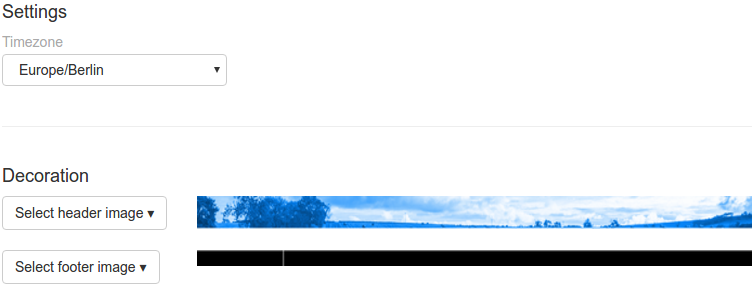
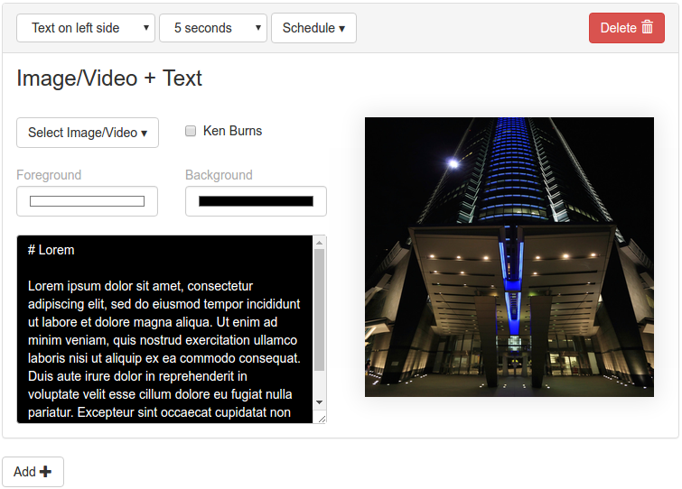
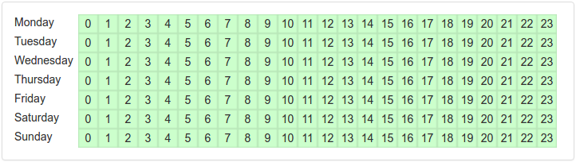

# Reception Screen

This package allows you to display images, videos and text next to a text scroller.
All offered with an easy configuration interface that allows you to schedule your
content.

[](https://info-beamer.com/use?url=https://github.com/info-beamer/package-reception)

## Configuration Screen

Once you install this package, create a new setup by clicking the **Create Setup** button.
You'll end up in the setup configuration page that allows you to configure your
reception screen. First you'll can set some general options that apply to all pages displayed.
It will look like this:



Make sure you set your correct time zone, so the clock in the bottom left corner
shows the correct time and date.

You also have the option to set a header and footer images. The header images
should have the resolution 1920x100, so it fits perfectly. The header image
is shows for all pages except when you choose to show an images/video in
fullscreen mode.

You can also set a footer image. It should be 1920x50. The left 300 pixels
are used by the clock. The remaining pixels show the scrolling text.

You can use the included *example-footer.png* and *example-header.png* can
be used to test.

If you want to play audio for video files, select the *audio* checkbox.

## Adding Pages

Now it is time to add your content. You can add as many pages as you want.
Just click on **Add** to create a new page.



In the top panel you can select multiple layouts:

 * *Text on left side* - Will show an image and a text. The text will be on the left half of the screen.
 * *Text on right side* - Same as above except that the text is on the right side.
 * *Fullscreen* - Show a video/image in fullscreen mode. This will hide the header image. Only the
   scrolling text and the clock is visible.

Next to the layout dropdown you can see the *Duration* selector. You can select how long the
current page should be visible before switching to the next one.

Finally you can select a custom schedule for your content. By default your content is always
scheduled. If you click on the *Schedule* button, a new grid of options will be visible:



You can click on each individual hour to toggle whether the current page should be
visible or not. If you want to change multiple hours at once, just click and hold
the left mouse button while moving over multiple hours. You can also toggle complete
days if you click on the name of a day.

## Fullscreen Pages

If you choose the fullscreen page layout you can select one of your images/videos.
It will take up most of the screen except for the static buttom bar with its
scrolling text/clock.

## Text Right/Left Pages

If you select one of the text page options you can now select an image or video.
It should have a resolution of 960x930 to fit perfectly into one half of the
screen. For images you'll also have the option of selecting whether or now
the image should slowly pan (the ken-burns effect).

You can also select the background and text color for the other half of the
screen. Just click on the color selectors and choose your color.

Finally there is the text field that allows you to input the text you
want to show on the screen. It supports a limited set of markdown to
allow you to easily format your text:

Use *#* or *##* to create a headline like this:

```
# Headline

## Sub header

Normal text
```

You can also render tabular data using the *|* character like this:

```
Opening times:

Mo-Fr | 9am - 6pm
Sa | 1pm - 6pm
So | Closed
```

All text is automatically wrapped and centered on the screen.

## Scrolling Text

If you want to add scrolling text, select the *Scroller* node on
the left side of the configuration screen. You'll see the
configuration interface for the scroller. You can add your
own text here by clicking on the *Add Text* button and then
adding your text in the new row.

## Changelog

### Version 0.3

 * Added the ability to enable audio output for all video files.
   If you enable this option, be sure that your device actually outputs
   audio to the correct [audio target](https://info-beamer.com/doc/device-configuration#specifyaudiotarget).

### Version 0.2

 * Added support for the "automatic duration" setting per page.
